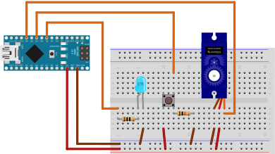

# GuCore: the core for a 3D-printed Sheikah Guardian

// TODO: write readme

## 3D Print
[Guardian Robot by steveut, Thingiverse](https://www.thingiverse.com/thing:2391826)

## Hardware

1. Arduino Nano
2. 10mm 200mA 3-3.3V LED (Used for the Guardian's Eye)
3. ? resistor
4. ? resistor
5. Momentart tactile switch
6. Micro servo (I use a SG90)

And wires.

Image generated using [Fritzing](http://fritzing.org)
